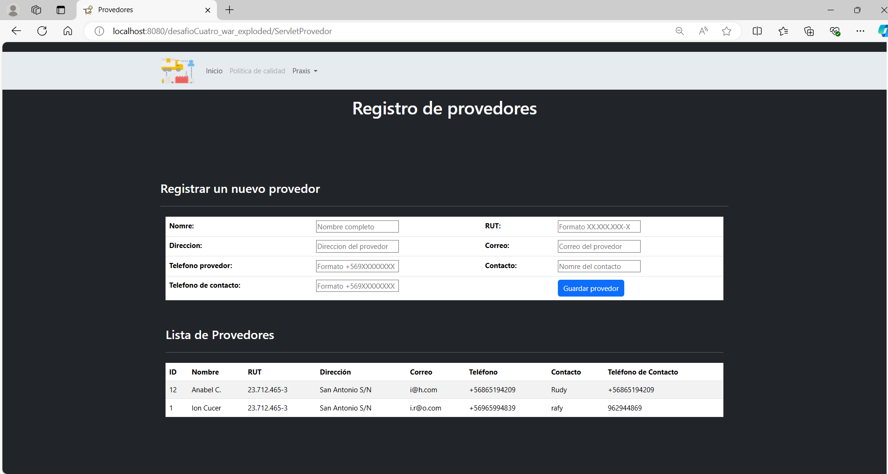

## Tips para probar el funcionamiento de la WebApp

1. En el archivo **Conexion.java**, ubicado en el paquete **cl.praxis.desafiocuatro.conexion**, que contiene la conexión a la base de datos, debes ingresar el puerto de la base de datos, el nombre del usuario y por último, la contraseña:

   ```java
   connection = DriverManager.getConnection("jdbc:mysql://localhost:3307/provedoresdb", "root", "mAcder");
Debes cambiar estos elementos por tus propias credenciales:
- **3307** - puerto de la base de datos.
- **provedoresdb** - nombre de la base de datos.
- **root** - usuario de la base de datos.
- **mAcder** - contraseña de la base de datos.

2. A continuación, se muestra una captura de pantalla que ilustra el funcionamiento y la ordenación de los resultados en orden alfabético, como se requiere en el desafío:<br>
<br>   

